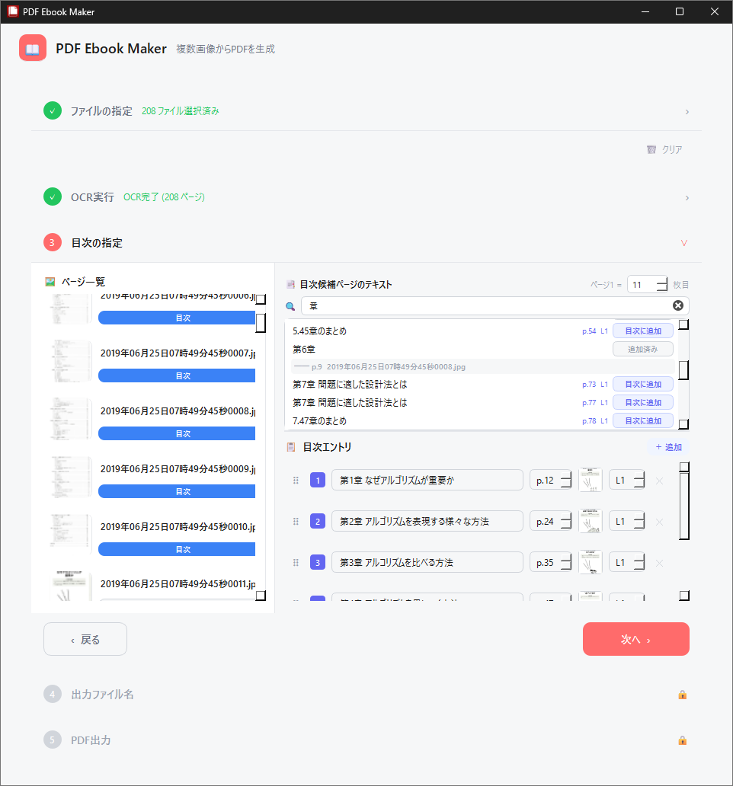

# PDF eBook Maker

スキャンした文書の画像をもとに、電子書籍として扱える（テキストが検索やコピー可能で、目次がついた）PDFファイルを生成するツールです。

処理はすべてアプリを動作させている端末上で行われ、サーバー等には送信されません。

OCR処理はCPUのみで利用可能な軽量なアルゴリズムを使用しています。

## ライセンス

本アプリ自体はMITライセンスです。

なお、本アプリは、OCRに国立国会図書館が提供する [NDLOCR-Lite](https://github.com/ndl-lab/ndlocr-lite) を利用しています。NDLOCR-Lite は Creative Commons Attribution 4.0 (CC BY 4.0) のもとで提供されています（詳細は [NOTICE](./NOTICE) をご覧ください）。

本アプリにおける改変内容：
- アプリケーションへの統合
- 前処理および推論処理の調整
